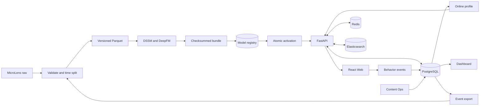

# MicroLens-50K Recommendation System MVP

基于官方 MicroLens-50K 数据构建的可运行、可复现推荐系统 MVP，打通：

```text
数据校验与时间切分 -> DSSM 召回 + DeepFM 排序 -> 模型注册与原子激活
-> 多用户/多路 Feed -> 曝光与行为回传 -> 在线画像更新
-> Dashboard 观测 -> 强推、下线、恢复与审计
```

- 源码：https://github.com/S4aiiko/microlens-recsys-mvp
- 本地 Web Demo：`http://localhost:25173`
- 本地 API：`http://localhost:18080`
- OpenAPI：`http://localhost:18080/docs`
- 环境：Docker Compose，CPU-only，不需要 GPU 或付费云服务

> 仓库不包含 MicroLens 原始数据、真实密钥或大型模型文件。数据从官方地址单独下载，`.env` 和模型产物均在本地生成。

## 1. 完成度与范围

| 模块 | 状态 | 说明 |
|---|---|---|
| MicroLens-50K 数据处理 | 已完成 | 交互、标题、点赞/播放统计；生成 train/validation/test、items、user history、train-only popularity 和质量报告 |
| 全量数据预处理 | 已完成 | 50,000 用户、19,220 内容、359,708 交互；259,708/50,000/50,000 时间切分 |
| 离线模型 | 已完成 smoke | DSSM、DeepFM、random/popularity baseline、早停、checkpoint、导出、指标和 badcase |
| 全量模型训练 | 部分完成 | 全量配置、预处理数据和执行框架已提供；当前公开评估结果来自可复现的 smoke 训练 |
| 多用户与权限 | 已完成 | 注册、Argon2、JWT HttpOnly session、CSRF、退出、会话撤销、四级 RBAC、3 个普通测试用户 |
| 推荐信息流 | 已完成 | personalized、popular、explore；cursor、分页、去重、已看过滤、多样性、模型降级 |
| 事件与画像 | 已完成 | canonical impression；click、like、not_interested、dwell、revisit、share；幂等、画像更新和训练导出 |
| Dashboard | 已完成 | PostgreSQL 真实聚合、趋势、CTR、Feed 占比、用户/请求追踪、CSV、模型状态 |
| 内容运营 | 已完成 | 搜索、强推、定向、位置/优先级、定时任务、下线、恢复、冲突校验和审计 |
| 视频/封面 | 范围内降级 | 不加载原始视频；封面不可用时展示占位图，符合题目必选范围 |

## 2. 最快启动：官方数据 smoke 闭环

该方式用于快速复现完整系统闭环，自动完成：环境检查、镜像构建、官方数据固定 1,000 用户子集处理、训练评估、模型注册/激活、迁移/seed、搜索索引以及七个服务启动。

### 2.1 前置要求

- Docker Desktop 和 `docker compose`
- 建议至少 4 CPU、8 GB 内存、10 GB 可用磁盘
- 首次运行需要网络拉取镜像和依赖
- smoke 首次运行预计 10-30 分钟，取决于网络、镜像构建和 CPU；已有镜像时通常更快

### 2.2 官方数据

数据来源为 [MicroLens GitHub](https://github.com/westlake-repl/MicroLens) 和[官方 MicroLens-50K 下载页](https://recsys.westlake.edu.cn/MicroLens-50K-Dataset/)。数据集遵循原项目的使用约束，不在本仓库重新分发。

```text
dataset/
├── MicroLens-50k_pairs.csv
├── MicroLens-50k_titles.csv
└── MicroLens-50k_likes_and_views.txt
```

`MicroLens-50k_covers.zip` 可选；缺少封面时使用占位图。检查输入：

```bash
make data-inspect
```

### 2.3 初始化环境

```bash
make init-env
chmod 600 .env
```

该命令生成本地随机数据库密码、JWT secret、内部发布 token 和 Demo 密码，并保留已有值。`.env` 已被 Git 忽略。

获取测试账号密码：

```bash
sed -n 's/^MICROLENS_SEED_PASSWORD=//p' .env
```

该输出属于本地凭据，不应出现在公开日志、截图或演示视频中。

### 2.4 一键运行

每次全新 smoke 使用一个未用过的小写 run ID：

```bash
export SMOKE_RUN_ID=demo-0904-a
make smoke-all
```

成功时最后一行 JSON 包含 `"status":"PASS"`、`data_version` 和 `model_version`。随后访问：

- Web：`http://localhost:25173`
- Readiness：`http://localhost:18080/ready`
- OpenAPI：`http://localhost:18080/docs`

```bash
curl -fsS http://localhost:18080/ready
curl -fsS -o /dev/null http://localhost:25173/
docker compose --project-name microlens-review ps
```

### 2.5 恢复已成功运行过的 smoke

必须复用当时的 `SMOKE_RUN_ID`。以下方式不重新训练，而是恢复对应持久卷和 ACTIVE 模型：

```bash
export SMOKE_RUN_ID=demo-0904-a
export COMPOSE_PROJECT_NAME=microlens-review
export API_PORT=18080
export WEB_PORT=25173
export WEB_ORIGIN=http://localhost:25173
export PHASE2D_POSTGRES_PORT=45432
export PHASE2D_REDIS_PORT=46379
export PROCESSED_DATA_DIR=./artifacts/data
export MICROLENS_DATA_DIR=./dataset
export SMOKE_API_RESTORE_ACTIVE_MODEL=true

docker compose --project-name microlens-review --env-file .env \
  -f compose.yaml \
  -f scripts/compose.integration.yaml \
  -f scripts/compose.smoke.yaml \
  up -d --wait
```

如果 Web 使用 `25173`，`WEB_ORIGIN` 必须是 `http://localhost:25173`，否则浏览器登录会被 CORS 拒绝。

### 2.6 停止

保留上述环境变量，在同一终端执行：

```bash
docker compose --project-name microlens-review --env-file .env \
  -f compose.yaml \
  -f scripts/compose.integration.yaml \
  -f scripts/compose.smoke.yaml \
  down
```

默认不使用 `-v`，因此 Demo 事件、模型注册状态和数据库会保留在本地数据卷中。

## 3. 测试账号

所有 seed 账号共用 `.env` 中的 `MICROLENS_SEED_PASSWORD`；密码不会写入源码或日志。

| 用户名 | 角色 | 用途 |
|---|---|---|
| `demo_user_a` | user | 用户 A 个性化结果和行为画像 |
| `demo_user_b` | user | 用户 B 差异和数据隔离 |
| `demo_user_c` | user | 第三用户/冷启动 |
| `operator_readonly` | operator_readonly | 只读 Dashboard 和 Operations |
| `operator` | operator | Dashboard 和运营写操作 |
| `admin` | admin | 全部能力及角色管理 |

普通用户调用管理 API 会被服务端返回 403，不依赖前端隐藏按钮实现隔离。


## 4. 系统架构



技术栈：Python 3.12、PyArrow/Parquet、PyTorch CPU、FastAPI、SQLAlchemy/Alembic、PostgreSQL 16、Redis 7、Elasticsearch 9、React/TypeScript/Vite/Recharts、Docker Compose。

模型发布边界位于 API 内部 listener：注册时校验 manifest/artifact checksum；激活时先加载和 smoke 检查，再原子替换模型槽并提交 ACTIVE。失败不会覆盖上一可用版本；内部接口不暴露主机端口并要求独立 `PUBLISH_TOKEN`。

## 5. 数据处理与防泄漏

输入和输出：

- pairs：`user, item, timestamp`
- titles：`item, title`
- likes/views：展示统计
- 输出：train/validation/test、items、user_history、train_popularity、title_corpus、manifest、quality_report

数据版本由配置、seed 和源文件 checksum 决定。切分与防泄漏策略：

- 按用户 UTC timestamp 严格留出，相同 timestamp 整组进入同一 split。
- 评估用户满足 `max(train_time) < min(validation_time) < min(test_time)`。
- 低交互用户进入 train-only。
- popularity、time decay、负采样和排除历史只读 train。
- likes/views 快照只用于展示，不进入可能泄漏未来信息的训练特征。
- 重复、非法时间、空必填字段、孤儿 item 和非法 metadata 自动拒绝。
- 负采样支持 uniform 和 popularity-aware (`alpha=0.75`)；全量数据支持 30 天半衰期。

全量处理结果：

| 指标 | 数值 |
|---|---:|
| 用户 | 50,000 |
| 内容 | 19,220 |
| 交互 | 359,708 |
| Train | 259,708 |
| Validation | 50,000 |
| Test | 50,000 |
| 重复/非法时间/空值/孤儿 | 0 |

```bash
make data-inspect
make full-data

PYTHONPATH=. python -m recsys.data.cli build-official \
  --config configs/data/smoke.yaml \
  --raw-dir dataset \
  --output-root artifacts/data
```

全量质量报告：`output/phase7a/data/microlens50k-cd591aacb9147924/quality_report.json`。

## 6. 模型、评估与结果

两阶段链路：

1. DSSM：用户历史塔与 item/title 塔生成 embedding，返回 Top-N 候选。
2. DeepFM：使用 DSSM 分数、标题相似度、train-only popularity/novelty、用户活跃度和时间衰减重排。
3. Baseline：random、train-only popularity。
4. 支持固定 seed、checkpoint、validation early stopping、导出 checksum、badcase 和最终一次 test 评估。

评估使用完整目录并排除 train 已看内容，K 为 5/10/20。Recall@K 表示留出正样本进入 Top-K 的比例；HitRate@K 表示用户是否至少命中；NDCG@K 对更靠前的命中赋予更高权重。Early stopping 只使用 validation NDCG。

当前 smoke 数据版本 `microlens50k-5242f9dac31d99db`、模型 `model-5d93b51706cb9407f10a`：

| 方法 | Recall@5 | Recall@10 | Recall@20 | NDCG@20 |
|---|---:|---:|---:|---:|
| random | 0.000 | 0.000 | 0.000 | 0.0000 |
| popularity | 0.003 | 0.004 | 0.010 | 0.0041 |
| DSSM | 0.001 | 0.004 | 0.004 | 0.0015 |
| DSSM + DeepFM | 0.004 | 0.004 | 0.004 | 0.0017 |

指标证明链路可运行，但不证明学习模型优于 popularity。可能原因：smoke 用户少、正反馈稀疏、标题特征弱、epoch 少、完整目录检索难度高。

产物位于：

- `artifacts/models/model-5d93b51706cb9407f10a/metrics.json`
- `artifacts/models/model-5d93b51706cb9407f10a/stage_training.json`
- `artifacts/models/model-5d93b51706cb9407f10a/badcases.csv`
- `artifacts/models/model-5d93b51706cb9407f10a/bundle.json`

模型产物默认由本地运行生成并被 Git 忽略；可通过独立的 Release artifact 分发 smoke bundle、metrics 和 badcases，原始数据不随产物分发。

全量配置为 `configs/models/full-a.json`：

```bash
make up
make train-sync \
  DATA_VERSION=microlens50k-<version> \
  DATA_MANIFEST_CHECKSUM=<manifest-sha256> \
  MODEL_CONFIG=/workspace/configs/models/full-a.json
```

全量 CPU 训练预计数小时，建议至少 4 CPU、8 GB 内存和 10 GB 空闲磁盘。当前版本仅公开已经完成并可复现的 smoke 指标。

## 7. 在线 Feed、事件与训练回流

- personalized：DSSM、item-item CF、标题画像和 popularity 候选，经 DeepFM 与业务规则重排。
- popular：基于 train/线上统计的全局热度，可服务冷启动用户。
- explore：优先未看和低曝光内容，候选不足时明确 fallback。

每页返回 cursor、request ID、item、title、cover/placeholder、position、source、score、reason 和 model version。服务端写 recommendation request、exposure 和一对一 canonical impression。

客户端上报 click、like、not_interested、dwell、revisit、share。事件必须匹配当前用户真实 exposure 的 `request_id + item_id + position`，使用 event ID 幂等；伪造他人 exposure、非法停留时长或缺少 metadata 会被拒绝。有效行为更新 profile version、最近交互和正负/标题偏好，并影响下一次 personalized snapshot。

```bash
make export-events
make build-training-data \
  EXPORT=<export-manifest-or-directory> \
  BASE_DATA_VERSION=<base-data-version> \
  PURPOSE=systems_only
```

导出使用 watermark、checksum、mapping version 和 server timestamp 冻结边界，防止重复和未来窗口污染。

## 8. Dashboard 与运营

`/dashboard` 提供：用户、活跃用户、请求、曝光、点击、CTR、点赞、分享、重复访问、停留、下线内容、当前模型；按小时/Feed 趋势、Feed share、Hot items；用户画像、request trace、模型/训练任务和 CSV。全部来自 PostgreSQL 聚合。

`/operations` 提供：按 ID/标题/状态搜索；全体/用户/Feed 定向强推；priority、position、生失效时间；最多 100 项原子批处理；立即/定时 promote、offline、restore；完整审计。

服务端 online/offline 是最终权威：offline 优先于 promotion，并约束所有 Feed、强推和直接内容接口。

## 9. 数据模型与 API

核心实体：

- users、auth_sessions、user_profiles、items
- recommendation_snapshots、snapshot_items、recommendation_requests、exposures
- events、event_batches
- promotion_rules、operation_batches、operations
- model_versions、model_activation_attempts、training_jobs、job_attempts、training_export_watermarks

完整请求/响应和状态码见运行中的 OpenAPI。主要接口组：`/api/auth`、`/api/feeds`、`/api/events`、`/api/profile`、`/api/admin/dashboard`、`/api/admin/items`、`/api/admin/operation-batches`、`/api/admin/model-versions`。

一致性：request ID 贯穿推荐/曝光/行为；event ID 和业务 idempotency key 防重放；profile/item/model version 进入缓存 key；运营批量操作先全量 preflight 再事务提交；模型激活先校验再原子切换。

## 10. 失败恢复与安全

- 模型不可用或候选不足：回退 popularity/explore，并返回 fallback reason。
- Redis 运行中故障：推荐可降级；启动时 Redis 不可用则 readiness 失败。
- PostgreSQL 不可用：鉴权、事件和运营 fail closed，不以客户端缓存冒充成功。
- 训练/加载失败：记录失败原因，上一 ACTIVE 模型不变。
- 内容离线：返回前检查 PostgreSQL 权威状态，避免缓存或 promotion 绕过。
- 封面缺失：占位图降级，不影响推荐链路。
- Argon2 密码哈希、HttpOnly cookie、JWT 过期/撤销、CSRF、服务端 RBAC。
- `.env`、原始数据和运行产物不进入公开仓库。

## 11. 测试与验证

```bash
PYTHONPATH=. python -m pytest -q
make test-api
make test-integration

npm --prefix apps/web ci
npm --prefix apps/web test -- --run
npm --prefix apps/web run typecheck
npm --prefix apps/web run build
npm --prefix apps/web run check-client-drift

docker compose config --quiet
PYTHONPATH=. python scripts/generate_contracts.py --check
```

最近一次验证结果：后端 358 passed、33 skipped；1 项依赖 Git 的 ignore-boundary 检查在宿主环境单独通过。前端 130 tests、typecheck、build 和 generated client drift 通过；Compose config、Python compileall、contract drift、format 和 `git diff --check` 通过。

## 12. 环境变量

完整模板见 `.env.example`。

| 变量 | 用途 |
|---|---|
| `POSTGRES_*`、`DATABASE_URL` | PostgreSQL 初始化与连接 |
| `REDIS_URL` | 推荐缓存和任务协调 |
| `SEARCH_URL/SEARCH_READ_ALIAS` | Elasticsearch 与版本化索引 |
| `JWT_SECRET` | session token 签名 |
| `PUBLISH_TOKEN` | 内部模型激活认证 |
| `MICROLENS_SEED_PASSWORD` | 本地测试账号密码 |
| `WEB_ORIGIN` | CORS Web Origin，必须与浏览器地址一致 |
| `WEB_PORT/API_PORT` | 主机端口 |
| `MICROLENS_DATA_DIR` | 官方数据目录 |
| `PROCESSED_DATA_DIR` | 版本化处理数据目录 |
| `WORKER_MODEL_CONFIG` | worker 精确模型配置 |

## 13. 项目结构

```text
apps/
├── api/                 FastAPI、鉴权、Feed、事件、Dashboard、运营、模型注册
├── web/                 React/TypeScript 用户端与管理端
└── worker/              异步训练与 scheduler
recsys/
├── data/                解析、质量检查、时间切分、事件合流
├── models/              DSSM、DeepFM、baseline、评估、bundle
├── serving/             模型加载与在线打分
└── experiments/         全量/消融实验和资源约束
configs/                 数据、模型和 analytics 配置
scripts/                 启动、smoke、迁移、seed、实验和契约脚本
tests/                   unit、API、integration、contract、fault-path
compose.yaml             服务编排
.env.example             环境变量模板
```

## 14. 已知限制与一周迭代计划

已知限制：当前公开模型指标来自 smoke 数据；学习模型尚未超过 popularity baseline；系统不提供原始视频播放；模型产物通过本地构建或独立 artifact 获取，不进入源码仓库。

再给一周将：

1. 完成全量 control、负采样、时间衰减和 title ablation，形成完整评估报告。
2. 针对 popularity 偏置和稀疏用户优化 hard negatives、标题编码、损失和混排权重。
3. 发布可复现的小型 bundle、metrics、badcases 和 manifest 附件。
4. 增加浏览器 E2E、并发和故障演练，覆盖完整主旅程。
5. 统一展示 API latency、cache hit rate、queue depth 和 job duration。

## 15. AI 协作记录

开发中使用 OpenAI Codex 做需求拆解、代码生成、测试补全、故障定位和代码审查。关键 prompt 类型包括：将需求拆为数据/模型/在线/事件/Dashboard/运营任务；实现严格时间切分和泄漏检查；实现 DSSM + DeepFM、baseline、早停和 bundle；为多用户隔离、event/exposure、运营原子性、模型激活和缓存失效补负向测试；运行前后端、Compose 和契约检查并定位失败。

人机分工方面，AI 主要参与实现、测试和故障定位；人工决策和复核集中在需求边界、数据泄漏与指标口径、权限隔离、全量训练取舍、结果真实性和端到端验收。AI 生成内容通过源码检查、自动测试和真实服务请求验证。

典型修复包括：拒绝非规范 cursor 签名；固定实验 source checksum 与无网络运行边界；修正事件导出的 item/metadata 判断；验证 Compose smoke 资源隔离、模型重启恢复和 fail-closed 行为。

## 16. License 与数据边界

应用代码见 `LICENSE`。MicroLens 数据版权和使用条款以官方项目为准；仓库仅保存处理代码、配置和 schema，不公开分发原始数据。模型/评估附件不得包含可逆恢复的原始样本或受限媒体文件。
